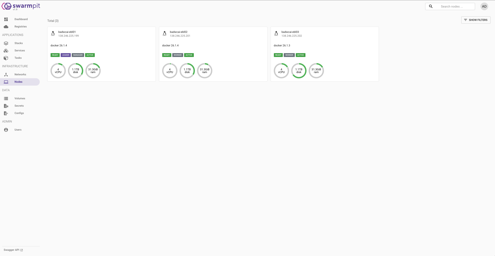
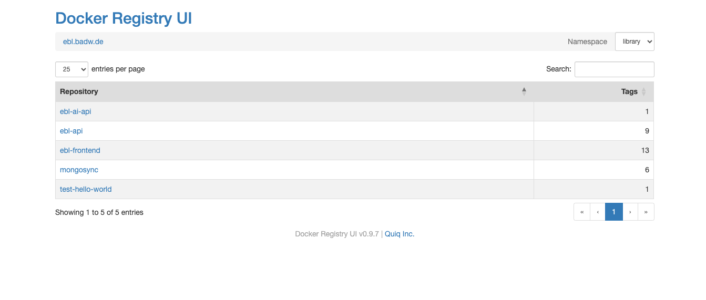

# Electronic Babylonian Library Infrastructure

This repository describes the architecture of the Electronic Babylonian Library, a Dockerized cuneiform editing platform hosted on three VMs at the [Leibniz Supercomputing Centre (Leibniz Rechenzentrum, LRZ)](https://www.lrz.de/english/) of the [Bavarian Academy of Sciences and Humanities (Bayerische Akademie der Wissenschaften, BAdW)](https://badw.de/en/the-academy.html).

## Table of Contents

- [Table of Contents](#table-of-contents)
- [1. General Architecture](#1-general-architecture)
- [2. Monitoring and Maintenance](#2-monitoring-and-maintenance)
- [3. Backup copies](#3-backup-copies)
- [4. Setup](#4-setup)
  - [4.1. Ordering VMs and DNS setup](#41-ordering-vms-and-dns-setup)
  - [4.2. Preparations](#42-preparations)
    - [4.2.1. Set up users](#421-set-up-users)
    - [4.2.2. Set up ssh keys](#422-set-up-ssh-keys)
    - [4.2.3. Install Docker](#423-install-docker)
    - [4.2.4. Set up the firewall](#424-set-up-the-firewall)
    - [4.2.5. Add image pruning](#425-add-image-pruning)
    - [4.2.6. Disable internal sum checking](#426-disable-internal-sum-checking)
  - [4.3. Docker Swarm Setup](#43-docker-swarm-setup)
    - [4.3.1. Initialize the swarm](#431-initialize-the-swarm)
    - [4.3.2. Optional: Test Swarmpit](#432-optional-test-swarmpit)
  - [4.4. SSL Certificates](#44-ssl-certificates)
  - [4.5. HTTPS and Monitoring](#45-https-and-monitoring)
    - [4.5.1. Traefik and Consul](#451-traefik-and-consul)
    - [4.5.2. Swarmpit](#452-swarmpit)
    - [4.5.3. Swarmprom](#453-swarmprom)
  - [4.6. MongoDB initialization](#46-mongodb-initialization)
  - [4.7. Replica set](#47-replica-set)
  - [4.8. Monitoring](#48-monitoring)
  - [4.9. Docker registry](#49-docker-registry)
  - [4.10. eBL application](#410-ebl-application)
  - [4.11. Mongosync](#411-mongosync)
- [5. Troubleshooting](#5-troubleshooting)
  - [5.1. Consul fails to elect a leader](#51-consul-fails-to-elect-a-leader)
  - [5.2. Redeployment fails in Swarmpit UI](#52-redeployment-fails-in-swarmpit-ui)
  - [5.3. Forgotten Grafana password](#53-forgotten-grafana-password)
  - [5.4. "invalid memory address or nil pointer dereference" from mongodb\_exporter](#54-invalid-memory-address-or-nil-pointer-dereference-from-mongodb_exporter)
  - [5.5. The cluster becomes unresponsive](#55-the-cluster-becomes-unresponsive)
  - [5.6. Low diskspace](#56-low-diskspace)
  - [5.7. Expired certificate](#57-expired-certificate)

## 1. General Architecture

The system consists of a Docker Swarm distributed over three Debian VMs. The web app is built in React/TypeScript and communicates with a Python backend and a MongoDB database. When a PR is merged into the master branch of the ebl-api or ebl-frontend repositories, a new Docker image is built and pushed to our own private Docker registry. The next time the ebl-stack is re-deployed (either via the commandline or the Swarmpit UI), the new image is pulled and goes live.

Each component of the system is implemented as a Docker stack that is configured with a YAML-file and optionally some other configuration
files or secrets (passwords and api keys). Each stack is deployed in a Docker swarm that distributed all services across the three VMs.
Changes to the swarm are only made on the main node (the manager) which delegates the tasks to the other nodes as appropriate. This way, if
one task fails (e.g., due to an error), the other nodes take over, reducing downtime to a minimum.

The MongoDB database follows a similar concept in that it is replicated. Each of the three VMs hosts one full copy of the entire data, and
read and write operations are distributed across and synchronized between the three replica members. One member of this replica set is the
primary, and the others are secondaries. If the primary fails, the remaining nodes perform a voting and elect a new primary that takes over
the function of the former primary. Though similar, the Docker swarm and the replica set are two different concepts (e.g., the Docker swarm
manager and the MongoDB primary node can be on separate VMs).

Networking is handled by Traefik, a reverse proxy that allows our Docker services to talk to each other and to become accessible from outside the server.

## 2. Monitoring and Maintenance

Monitoring and basic maintenance is primarily done via [Swarmpit](https://swarmpit.io/). Our instance is accessible at <https://www.ebl.lmu.de/cluster/swarmpit/> and allows you to check the system status, view logs, and (re-)deploy services.



For more complex tasks you need to access the servers via ssh. For that, you need to activate the BAdW full-tunnel VPN and log into the server
with your username and password. It is recommended to add the three nodes to your ssh config and set up ssh keys which greatly simplifies
access which is especially convenient for setting up the database which requires you to perform steps on each machine individually.

Additional information and statistics about the system are displayed in our Grafana instance [here](https://www.ebl.badw.de/cluster/grafana/). Traefik also comes with a UI that can be accessed at <https://www.ebl.badw.de/cluster/traefik/>. Our private Docker registry has a basic UI, too.

## 3. Backup copies

6 daily backup images of the servers are made, at 02:20, 06:20, 10:20, 14:20, 18:20 and 22:20 hrs. The images are kept for 14 days. The images
can be restored by the LRZ on short notice by opening a ticket on their [Service Desk](https://servicedesk.lrz.de/). If it is necessary to
restore a backup copy, the images of all nodes of the Replica Set should be restored, not just one of the nodes, as otherwise they will be out
of sync.

## 4. Setup

Knowledge about server infrastructure and Docker concepts (containers, images, networks, configs, secrets, etc.) is necessary.

The steps describe the state of the system right after the migration to new VMs in July 2024. We cannot
guarantee that the configuration reflects the latest state of the setup (though we do our best to keep everything up to date). The most
recently deployed versions of each part of the system can be seen in the Swarmpit UI. Whenever changes are made via Swarmpit, the corresponding file in
this repository should be updated accordingly. The local commands are also the MacOS variants which should mostly work on other operating
systems but may differ slightly.

### 4.1. Ordering VMs and DNS setup

We ordered three VMs directly at <https://vm.lrz.de/>. Once the machines are ready you receive an email with the default user and
password. Use the IP and default credentials from the email to access the VM (`ssh defaultusername@xxx.xxx.xxx.xxx`, enter password when prompted)
and change the default password. Be sure to store this and all other passwords safely, e.g., in a password manager like [KeePassX](https://www.keepassx.org/).

Masterusers can request configuration changes (like RAM or storage upgrades) by opening a ticket at the [Service Desk](https://servicedesk.lrz.de/).

For the DNS we asked the responsible hostmasters at LMU and BAdW (see
[Vergabe neuer Sub-Domains](https://doku.lrz.de/verwendung-eigener-domainnamen-10745829.html)) to set
up <www.ebl.badw.de> and <www.ebl.lmu.de> as aliases of our first VM in the DNS.

### 4.2. Preparations

The setup steps must be performed **on each VM individually**.
For most of the commands you will need `sudo`, but once Docker is set up and running the `docker` commands don't require it.

#### 4.2.1. Set up users

Activate the BAdW **full-tunnel** VPN. This is necessary even from within the on-site academy network.

Using the default sudo user and password provided by LRZ, ssh into the VM. Create (at least) two users, one for yourself
and the shared `ebladmin` user, and add them to the sudoer and ssh groups, e.g.:

```sh
adduser ebladmin
usermod -aG sudo ebladmin
usermod -aG ssh-login ebladmin
```

You can then switch to the new user with `su ebladmin`.

#### 4.2.2. Set up ssh keys

This step is optional (but you will soon regret it if you skip it): Set up an ssh key for your user(s) by following these steps
(please find more details online if needed):

**On your local machine:** Either create a new ssh key pair or use an existing one. Create or edit your .ssh/config file and add the following
contents. You may also need to add a line `IdentityFile ~/.ssh/my_id_rsa` to each entry if you're using a custom private key name/path.

  ```sh
  # CAIC eBL VM1
  Host caic1
    HostName 138.246.225.199
    Port 22
    User your_vm_username

  # CAIC eBL VM2
  Host caic2
    HostName 138.246.225.201
    Port 22
    User your_vm_username

  # CAIC eBL VM3
  Host caic3
    HostName 138.246.225.202
    Port 22
    User your_vm_username
  ```

**On the VM:** Add the contents of your **public** key file you created locally (e.g., ~/.ssh/id_rsa.pub) to the ~/.ssh/authorized_keys
file on the VM (create the file if it doesn't exist yet). A quick and easy way to do this is to open the file (`nano ~/.ssh/authorized_keys`) and paste the key contents into it.

If everything is set up correctly you should now be able to access each VM by running, e.g., `ssh caic1` from your commandline. The configuration is also automatically discovered
by Visual Studio Code and other IDEs, allowing you to conveniently connect to the servers from within your IDE.

#### 4.2.3. Install Docker

- [Install Docker Engine - Community from Docker's repositories](https://docs.docker.com/install/linux/docker-ce/debian/#install-using-the-repository)
  (current version: `Docker version 26.1.4, build 5650f9b`)
- Perform the [post-install steps](https://docs.docker.com/install/linux/linux-postinstall/).
  - Add both `ebladmin` and yourself to the `docker` group:

    ```sh
    usermod -aG docker your_user
    usermod -aG docker ebladmin
    ```

  - Copy [daemon.json](https://github.com/ElectronicBabylonianLiterature/infrastructure/blob/master/daemon.json) to
  `/etc/docker/daemon.json`  to set up log rotation and [metrics](https://docs.docker.com/config/thirdparty/prometheus/)
  (required by swarmprom). You can do so by running
  `curl https://raw.githubusercontent.com/ElectronicBabylonianLiterature/infrastructure/master/daemon.json >> /etc/docker/daemon.json`.
  - Restart the daemon with `service docker restart`. Note that the log configuration only affects new containers.
- `sudo service docker status` should show that Docker is active.

#### 4.2.4. Set up the firewall

Certain ports need to be opened for Docker to be able to communicate between the VMs. Docker additionally opens up ports via iptables that don't show up in the ufw rules
and that don't need to be configured separately.

For each VM, you need to allow traffic to the other two VMs. For the first VM, run the commands below with the IPs of the 2nd and 3rd VM. Adapt accordingly for the other VMs.

```sh
sudo ufw allow proto tcp from <VM2 IP> to any port 2377,7946 comment 'Docker Swarm'
sudo ufw allow proto udp from <VM2 IP> to any port 7946,4789 comment 'Docker Swarm'

sudo ufw allow proto tcp from <VM3 IP> to any port 2377,7946 comment 'Docker Swarm'
sudo ufw allow proto udp from <VM3 IP> to any port 7946,4789 comment 'Docker Swarm'
```

Additionally, the following port must be opened for metrics. This command is identical on all three VMs:

```sh
sudo ufw allow from 172.18.0.0/16 to any port 9323 comment 'Docker Metrics'
```

#### 4.2.5. Add image pruning

Old Docker images (and volumes) remain on the system and can cause the servers to run out of space eventually which leads to serious issues.
To prevent this, add a crone job to prune old images regularly. As the `ebladmin` user, run `crontab -e` and add the line below to the cron file:

```sh
0 4 * * * docker image prune -f --filter "until=24h" 2>&1 | /usr/bin/logger -t docker-pruning
```

This cronjob will automatically prune (delete) unused Docker images that are older than 24 hours and log the output with the tag "docker-pruning" every day at 4:00 AM.

#### 4.2.6. Disable internal sum checking

On Debian 12, Docker Swarm can sometimes fail due to issues with internal sum
checking. What happens is that after setting up the swarm, it is partially functional
(it can ping but cannot transfer any data). In Swarmpit the nodes show up but remain
in a "Loading..." state indefinitely. If such symptoms occur, you need to disable
internal sum checking with:

```sh
ethtool -K ens192 tx-checksum-ip-generic off
```

See [here](https://github.com/swarmpit/swarmpit/issues/688) for more details.

### 4.3. Docker Swarm Setup

For setting up the infrastructure you need the different YAML and other configuration files from this repository.
It is recommended to download all of it onto the first VM. The following commands will assume you did so from your user directory
(e.g., `cd ~ && git clone https://github.com/ElectronicBabylonianLiterature/infrastructure.git`).

#### 4.3.1. Initialize the swarm

On the first VM, [create a new swarm](https://docs.docker.com/engine/swarm/swarm-tutorial/create-swarm/). This turns
the first VM into the manager node of the swarm. It will output a command for joining the swarm which has to be run on
each of the two other VMs which will make them worker nodes. If you need to display the join command again, run
`docker swarm join-token worker` on the manager. Check the status of the swarm by running the command below on the manager node:

```sh
$ docker node ls
ID                            HOSTNAME        STATUS    AVAILABILITY   MANAGER STATUS   ENGINE VERSION
z2hbdfjkyqn3z1b8kmndm7exp *   badwcai-ebl01   Ready     Active         Leader           26.1.4
3bzj3ocpoqy1vvm07l56n7ef0     badwcai-ebl02   Ready     Active                          26.1.4
k5vo2xli9y8b4q9jcirx6byll     badwcai-ebl03   Ready     Active                          26.1.4
```

Unless specified otherwise, the commands below have to be run (only) on the manager node, i.e., the first VM caic1/badwcai-ebl01.

#### 4.3.2. Optional: Test Swarmpit

[Swarmpit](https://swarmpit.io) is a graphical management and monitoring tool for Docker swarm architectures. One of the
most important functions is to redeploy stacks with a few clicks. To test it, you can install it with the command below,
accepting the default options in the interactive installation:

```sh
docker run -it --rm \
  --name swarmpit-installer \
  --volume /var/run/docker.sock:/var/run/docker.sock \
swarmpit/install:1.8
```

Swarmpit should now be accessible at <http://badwcai-ebl01.srv.mwn.de:888/> (or the IP of the first VM at port 888).
In your browser, create the admin user. Once you are logged in, explore the interface: You should see the three VMs, their RAM and other
specs in the Nodes tab. If they show as "Loading..." for a prolonged period of time, see the section *Disable internal sum checking* above.

The swarm can be managed and set up from the Swarmpit UI, but for the sake of better documentation and reproducibility the instructions below
will focus on the CLI setup which will override the test instance.

### 4.4. SSL Certificates

For the MongoDB replica set we need to create SSL certificates. The instructions must be followed very carefully
since any errors in the configuration will cause the certificates to become invalid. For more info, see

- [Deploy a Replica Set with Transport Encryption](https://www.percona.com/blog/mongodb-deploy-replica-set-with-transport-encryption-part-3/)
- [Deploy a Replica Set](https://docs.mongodb.com/manual/tutorial/deploy-replica-set/)
- [Configure mongod and mongos for TLS/SSL](https://docs.mongodb.com/manual/tutorial/configure-ssl/)
- [Use x.509 Certificate for Membership Authentication](https://docs.mongodb.com/manual/tutorial/configure-x509-member-authentication/).

The following commands only need to be run once on the first VM and will then be stored in and managed by the swarm.

1. Create a `certificates` folder and `cd` into it.
2. Create a mongoCA.key file: `openssl genrsa -out mongoCA.key -aes256 8192`. Be sure to safely store the passphrase.
3. Create the mongoCA.crt with the command below.

   ```sh
   openssl req -x509 -new -extensions v3_ca -key mongoCA.key -days 1825 -out mongoCA.crt \
     -subj "/C=DE/ST=Bayern/L=Muenchen/O=Bayerische Akademie der Wissenschaften/OU=CAIC/CN=ebl.badw.de" \
     -addext "subjectAltName = DNS:badwcai-ebl01.srv.mwn.de, DNS:badwcai-ebl02.srv.mwn.de, DNS:badwcai-ebl03.srv.mwn.de, IP:138.246.225.199, IP:138.246.225.201, IP:138.246.225. 202"
   ```

4. The commands below need to be run **three times**, once for each VM. While the contents of `-addext` is identical for each command, but the `-subj` **is different**.
   **This is very important:** The content of `CN=` **must** match the internal server url on each node, otherwise the certificates **will not work**.
   For the 2nd and 3rd VM, replace `ebl01` with `ebl02` and `ebl03`, respectively. You will have to enter the mongoCA.key passphrase.

   ```sh
   openssl req -new -newkey rsa:4096 -nodes -keyout ebl01.key -out ebl01.csr \
     -subj "/C=DE/ST=Bayern/L=Muenchen/O=Bayerische Akademie der Wissenschaften/OU=CAIC/CN=badwcai-ebl01.srv.mwn.de" \
     -addext "subjectAltName = DNS:badwcai-ebl01.srv.mwn.de, DNS:badwcai-ebl02.srv.mwn.de, DNS:badwcai-ebl03.srv.mwn.de, IP:138.246.225.199, IP:138.246.225.201, IP:138.246.225.202"
   openssl x509 -CA mongoCA.crt -CAkey mongoCA.key -CAcreateserial -req -days 1825 -in ebl01.csr -out ebl01.crt -copy_extensions copyall
   cat ebl01.key ebl01.crt > ebl01.pem
   ```

   In the end your ./certificates folder should contain the following files:

   ```sh
   $ ls
   ebl01.crt  ebl01.csr  ebl01.key  ebl01.pem  ebl02.crt  ebl02.csr  ebl02.key  ebl02.pem  ebl03.crt  ebl03.csr  ebl03.key  ebl03.pem  mongoCA.crt  mongoCA.key
   ```

5. Store the required keys as [Docker secrets](https://docs.docker.com/engine/swarm/secrets/):

   ```sh
   docker secret create mongoCA.crt ./mongoCA.crt
   docker secret create ebl01.pem ./ebl01.pem
   docker secret create ebl02.pem ./ebl02.pem
   docker secret create ebl03.pem ./ebl03.pem
   ```

### 4.5. HTTPS and Monitoring

We use a setup based on the (now deprecated) [Docker Swarm Rocks](https://dockerswarm.rocks).

#### 4.5.1. Traefik and Consul

See: [Traefik Proxy with HTTPS](https://dockerswarm.rocks/traefik/)

The first stack will be the reverse proxy [Traefik](https://traefik.io/), and [Consul](https://www.consul.io/).
For some services we want to force the swarm to put them on specific nodes, e.g., just the manager.
For more fine-grained control, the recommended way is to use [labels](https://docs.docker.com/engine/swarm/manage-nodes/#add-or-remove-label-metadata).

Add the label `consul-host` to the first VM, badwcai-ebl01:

```sh
docker node update --label-add consul-host=true badwcai-ebl01
```

We need to create

- a Docker [network](https://docs.docker.com/network/),
- a Docker [config](https://docs.docker.com/engine/swarm/configs/), and
- a Docker [secret](https://docs.docker.com/engine/swarm/secrets/),

all of which will then be used by the Traefik [stack](https://docs.docker.com/engine/swarm/stack-deploy/).
For the network, run:

```sh
docker network create --driver=overlay traefik-public
```

For the configuration, replace `<admin_email>` in traefik.toml with your email or a function email address
(this will only be used on rare occasions to send you notifications). After that, add the config to Docker with:

```sh
docker config create traefik-config ~/infrastructure/traefik.toml
```

For the Docker secret you need to first create a `basic_auth_users` file in a specific format. Run

```sh
# if htpasswd is missing, install it with: sudo apt-get install apache2-utils
htpasswd -Bn admin > basic_auth_users
```

and enter the new password when prompted. These credentials will be used by Swarmpit and other services, and the file
should look similar to this:

```sh
admin:$2y$05$YXO...
```

Create the Docker secret by running `docker secret create basic_auth_users ./basic_auth_users`.
Next, create the stack `traefik-consul`:

```sh
docker stack deploy -c infrastructure/traefik-consul.yml traefik-consul
```

#### 4.5.2. Swarmpit

See: [Swarmpit web user interface for your Docker Swarm cluster](https://dockerswarm.rocks/swarmpit/).

The swarmpit stack does not require any prior set up and can be directly deployed with:

```sh
docker stack deploy -c swarmpit.yml swarmpit
```

The UI should now be accessible at <https://www.ebl.badw.de/cluster/swarmpit/>.

#### 4.5.3. Swarmprom

See: [Docker Swarm Rocks Swarmprom for real-time monitoring and alerts](https://dockerswarm.rocks/swarmprom/).

[Swarmprom](https://github.com/stefanprodan/swarmprom) is a monitoring toolkit for Docker swarm and allows for broadcasting system info to Slack.

1. Create a [webhook](https://api.slack.com/incoming-webhooks) in Slack and replace the `<token>` placeholder in swarmprom.yml with the Slack api token.
2. Create network `docker network create --driver=overlay monitoring`.
3. Create the configs:

   - `dockerd_config` from [swarmprom Caddyfile](https://github.com/stefanprodan/swarmprom/blob/master/dockerd-exporter/Caddyfile).
   - `node_rules` from [swarm_node.rules.yml](https://github.com/ElectronicBabylonianLiterature/infrastructure/blob/master/swarm_node.rules.yml).
   - `task_rules` from [swarm_task.rules.yml](https://github.com/ElectronicBabylonianLiterature/infrastructure/blob/master/swarm_task.rules.yml).

4. Replace the password placeholders in `GF_SECURITY_ADMIN_PASSWORD` and the MongoDB uri in the `mongodb-exporter` service in ~/infrastructure/swarmprom.yml with your own.
   We cannot use Docker secrets here (the [swarmprom Dockerfile](https://github.com/stefanprodan/swarmprom/blob/master/grafana/Dockerfile) defines `GF_SECURITY_ADMIN_PASSWORD`
   so we cannot use the alternative `GF_SECURITY_ADMIN_PASSWORD__FILE`).
5. Deploy the `swarmprom` stack: `docker stack deploy -c ~/infrastructure/swarmprom.yml swarmprom`. The mongodb-exporter will fail until MongoDB is set up
   properly (see below) - you may want to comment it out for now and uncomment and redeploy after setting up MongoDB below, by editing the YAML-file and running the deploy command again.

You should now be able to log into the grafana ui at <https://www.ebl.badw.de/cluster/grafana/>.

Import the [Traefik dashboard](https://grafana.com/grafana/dashboards/4475) to Grafana.

### 4.6. MongoDB initialization

For the database we will first set up a basic stack without encryption, running one MongoDB container per VM.
The instances are initially independent and will later be linked into a replica set.

- Create the Docker secrets to be used to create the admin user on the first deploy. Create a text file `mongo_admin_user`
  for the username and another file `mongo_admin_password` for the (unencrypted) password. Create the secrets:
  - `docker secret create mongo_admin_user ./mongo_admin_user` and
  - `docker secret create mongo_admin_password ./mongo_admin_password`
- Create the intial `ebl-mongodb` stack: `docker stack deploy -c ~/infrastructure/mongodb.yml ebl-mongodb`. This will initialize the db without SSL encryption
  first; we do it this way because enabling encryption right away does not work well, and update the stack in the next step.

### 4.7. Replica set

For the replica set we need to update the `ebl-mongodb` stack with SSL (and some more configuration). This will override the previous, basic stack, but the volumes
initialized in the previous step will persist.

Redeploy the stack, this time using the main YAML file:

```sh
docker stack deploy -c ~/infrastructure/mongodb-replica_set.yml ebl-mongodb
```

Once the stack is up you should see one container running MongoDB per VM:

```sh
$ docker ps --filter "name=ebl-mongodb_mongo"
CONTAINER ID   IMAGE       COMMAND                  CREATED              STATUS        PORTS       NAMES
fb50c6855997   mongo:7.0   "docker-entrypoint.s…"   About a minute ago   Up a minute   27017/tcp   ebl-mongodb_mongo1.1.o4936ktq907z30o2m8trhs1j2
```

You should now be able to access MongoDB by `exec`-ing into the container and firing up `mongosh`. Using the container ID from the previous command:

```sh
docker exec -it fb50c6855997 bash
```

And in the container's bash terminal, start up `mongosh` (use the `mongo_admin_user` and, when prompted, the `mongo_admin_password` we defined earlier):

```sh
mongo --tls -u admin --tlsAllowInvalidCertificates
```

In mongosh, initiate the replica set by running the command below (you may need to run `use admin` first):

```js
rs.initiate( {
   _id : "rs-ebl",
   members: [
      { _id: 1, host: "badwcai-ebl01.srv.mwn.de:27017" },
      { _id: 2, host: "badwcai-ebl02.srv.mwn.de:27018" },
      { _id: 3, host: "badwcai-ebl03.srv.mwn.de:27019" }
   ]
})
```

If successful, it should give you information about all three nodes of the replica set that are deployed on the three VMs. Your prompt should also
reflect the new state as replica set `primary` or `secondary`. If it fails, it is most likely due to incorrect configuration of the SSL certificates.
You can verify that by deploying the basic MongoDB stack without SSL again and repeat the replica setup steps above. If it succeeds there is certainly
an SSL issue (and no network, firewall, or other configuration problem). To re-generate the certificates, you will need to remove the stacks using
the broken Docker secrets:

```sh
docker stack rm swarmprom
docker stack rm ebl-mongodb
```

Remove the secrets:

```sh
docker secret rm ebl01.pem ebl02.pem ebl03.pem mongoCA.crt
```

And re-generate the certificates and secrets as described above.

### 4.8. Monitoring

See: [eses/mongodb_exporter
](https://hub.docker.com/r/eses/mongodb_exporter) and [](https://www.percona.com/doc/percona-monitoring-and-management/section.exporter.mongodb.html).

We can now create a user for the MongoDB exporter service in the `swarmprom` stack, replacing the password placeholder with the password we added to the MongoDB uri earlier:

```js
db.getSiblingDB("admin").createUser({
    user: "mongodb_exporter",
    pwd: "<password>",
    roles: [
        { role: "clusterMonitor", db: "admin" },
        { role: "read", db: "local" }
    ]
})
```

On this occasion, we can also create the `ebl-api` and `mongosync` users for the eBL app:

```js
db.getSiblingDB("admin").createUser({
    user: "ebl-api",
    pwd: "<password>",
    roles: [
        {
          "role": "readWrite",
          "db": "ebl"
        },
        {
          "role": "readWrite",
          "db": "ebldev"
        }
  ]
})

db.getSiblingDB("admin").createUser({
    user: "mongosync",
    pwd: "<password>",
    roles: [
        {
          "role": "read",
          "db": "ebl"
        },
        {
          "role": "readWrite",
          "db": "ebldev"
        }
  ]
})
```

Now you can uncomment the `mongodb-exporter` service from the `swarmprom` stack and redeploy the stack by running
`docker stack deploy -c ~/infrastructure/swarmprom.yml swarmprom` again.

You can now import the [MongoDB dashboard](https://grafana.com/grafana/dashboards/2583) to Grafana. In Grafana, edit the dashboard JSON and change the metric
prefix from `mongodb_` to `mongodb_mongod_`.

### 4.9. Docker registry



The private Docker registry is were the eBL api and frontend apps will be pushed by GitHub CI and then pulled by our stacks when being redeployed after updates.
It requires a separate set of credentials and configs.

**For the configurations:** [Generate a UUID](https://www.uuidgenerator.net/) and replace the `Bearer`/`event_listener_token` placeholders in the registry_config.yml
and docker-registry-ui_config.yml. It just has to be something difficult to guess that matches between the two configuration files. Create the configs with:

```sh
docker config create registry_config ~/infrastructure/registry_config.yml
docker config create docker-registry-ui_config ~/infrastructure/docker-registry-ui_config.yml
```

**For the secrets:** Similar to `basic_auth_users` above, create a file `registry_htpasswd` by running `htpasswd -Bn admin > registry_htpasswd`
and entering a new password. We also need a `github` user that is used by GitHub CI to authenticate when pushing to the registry.
The credentials must match the secrets set up in GitHub and passed to the CI YAML both in the ebl-api, ebl-frontend, and the ebl-ai-api.
This time, run `htpasswd -Bn github` and append the output to the `registry_htpasswd` file so it has two sets of credentials, one per line.

The admin password also needs to be stored as clear-text secret, so paste the password into a file `docker-registry-ui_admin_password`.

Now, create the secrets:

```sh
docker secret create docker-registry-ui_admin_password ./docker-registry-ui_admin_password
docker secret create registry_htpasswd ./registry_htpasswd
```

And deploy the registry stack:

```sh
docker stack deploy -c ~/infrastructure/registry.yml
```

The registry comes with a basic UI that should now be accessible at <https://www.ebl.badw.de/cluster/registry-ui/> (after login). If GitHub workflows
are set up to push to this registry, visit the ebl-api and ebl-frontend repos and manually trigger a CI run for each. The images should then be visible in the UI.

Before pulling from the registry it may be necessary to run `docker login ebl.badw.de` and logging in using the credentials we just set. Otherwise, Docker may
be unable to pull, showing `No such image`. It may even be necessary to login twice, once with and once without `sudo`, and on all VMs individually, and
pass the `--with-registry-auth` flag when `deploy`ing.

### 4.10. eBL application

In ebl.yml, replace the placeholders in `services.api.environment` with the real keys/credentials, and deploy the stack:

```sh
docker stack deploy -c infrastructure/ebl.yml ebl --with-registry-auth
```

If it fails with `No such image`, make sure the image is in the registry and be sure to `docker login` as described above. If it fails with another error (`Non-zero exit`),
it means the container was successfully pulled but the app failed to start for some other reason, e.g., incorrect environment variables or a wrong command.

Note that the environment variables for the frontend are configured in [GitHub actions](https://github.com/ElectronicBabylonianLiterature/ebl-frontend/blob/master/.github/workflows/main.yml)
and passed to the Docker image from there.

The `ai-api` service is optional and could be left out (but the `EBL_AI_API` environment variable must be set either way).
The **ebl-ai-api repository** is [here](https://github.com/ElectronicBabylonianLiterature/ebl-ai-api). The `redis-exporter` service and the corresponding `prometheus` job
in the `swarmprom` stack are needed for the ai-api.

### 4.11. Mongosync

The script for populating the development db `ebldev` is developed in a dedicated repository at <https://github.com/ElectronicBabylonianLiterature/mongosync>.
It requires `mongosync_user` and `mongosync_password` Docker secrets matching the credentials set up above (see section *Monitoring*). Download the
docker-compose.yml or clone the repository and run `docker stack deploy -c mongosync/docker-compose.yml mongosync`.

## 5. Troubleshooting

### 5.1. Consul fails to elect a leader

- Scale replicas to 0.
- Scale replica back to desired value.

When the new replicas join Consul should clean up old nodes and elect a new leader. To avoid stale nodes in the config the replicas should be shut down before the leader.

### 5.2. Redeployment fails in Swarmpit UI

Long commands (e.g. `node-exporter`) get messed up and `$` is unescaped in the "Current engine state". If you have to redeploy a service/stack edit the "Last deployed" instead
or copy the correct values from the server.

### 5.3. Forgotten Grafana password

The Grafana admin password is set up only on first run. It can be resetted later vie the CLI `docker exec -ti <container id> grafana-cli admin reset-admin-password <new password>`.

### 5.4. "invalid memory address or nil pointer dereference" from mongodb_exporter

There is a bug in the exporter ([PMM-4375](https://jira.percona.com/browse/PMM-4375)). We should update it as soon as the fix is released. The exporter has been updated.

### 5.5. The cluster becomes unresponsive

Docker can be restarted from the commandline by running `sudo service docker restart` in all the affected instances. If it is not possible to connect with SSH, ask ITG to reboot/investigate.

### 5.6. Low diskspace

Diskspace can be freed by removing old Docker images etc. See: <https://stackoverflow.com/questions/32723111/how-to-remove-old-and-unused-docker-images/32723127#32723127>

### 5.7. Expired certificate

The certificates are handled automatically by [Let's Encrypt](https://letsencrypt.org/) and `certbot` (managed in the Traefik configuration, cf.
the [Traefik docs](https://doc.traefik.io/traefik/v1.7/configuration/acme/)).
In case if fails the website becomes unavailable via https once the certificate expires. It might be necessary to manually restart the
`traefik-consul_traefik` service in swarmpit or via the server.
